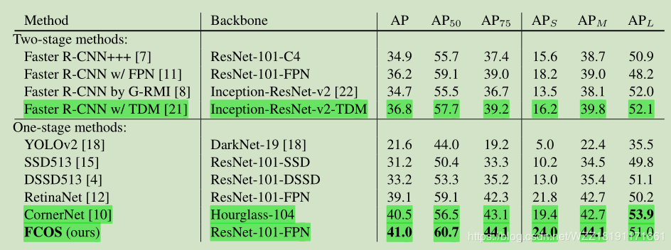
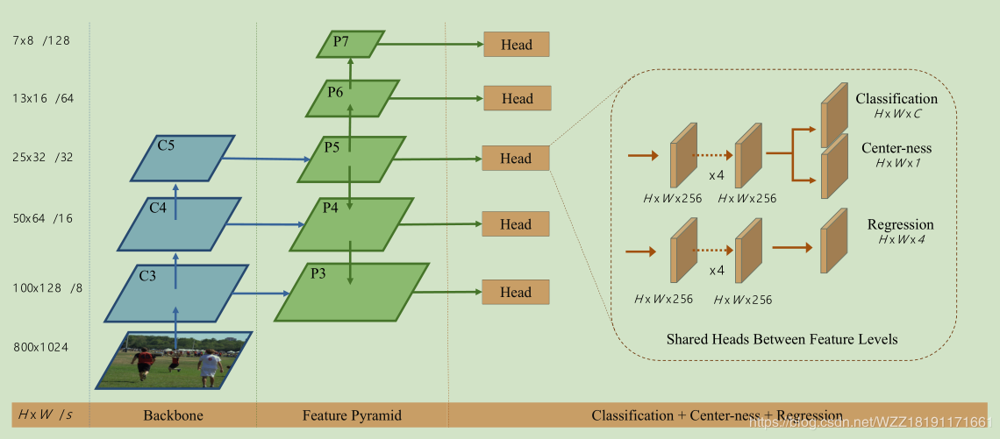
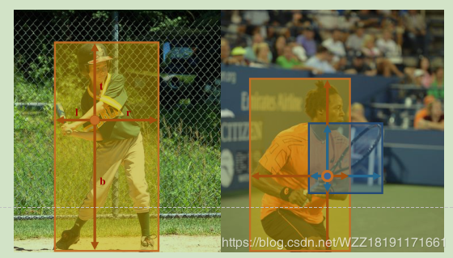
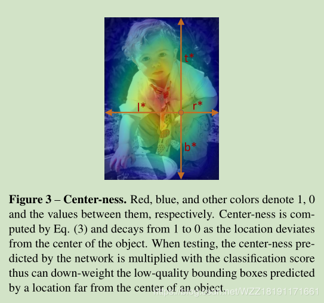
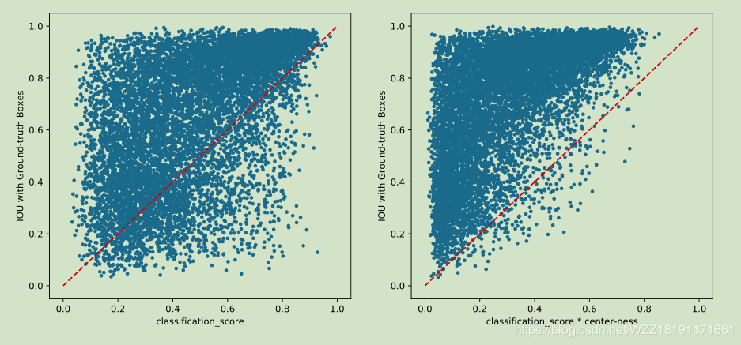

## FCOS

FCOS是一个基于anchor-free的单阶段目标检测算法,代表性的算法包括CornerNet和FCOS

### 为什么会这么火

- 尽管是一个单阶段的目标检测算法，但是检测的精度却得到的极大的提升，远远超过了Faster-rcnn；
- 该算法是基于anchor-free的，即敢于去挑战权威，在目标检测领域中，很多人可能都形成了一个定势思路，为了处理尺度和不同比率问题，anchors是必须使用的模块，而本文的作者敢于脱离这个思路提出一个较新的视角，使得人们眼前一亮；
- 其实在检测领域中自从Faster-rcnn出现之后，已经很久没有什么特别的检测算法啦，大家基本都是小改小动；
- 除此之外，FCOS算法的宣传力度比较大，开源工作也做的比较好，这些都是一些关键的因素。

### FCOS的优势

#### 提出fcos原因：
- anchor会引入很多需要优化的超参数， 比如anchor number、anchor size、anchor ratio等；
- 为了保证算法效果，需要很多的anchors，存在正负样本类别不均衡问题；
- 在训练的时候，需要计算所有anchor box同ground truth boxes的IoU，计算量较大；

#### anchor-free派系中算SOTA
- 因为输出是pixel-based预测，所以可以复用semantic segmentation方向的相关tricks；
- 可以修改FCOS的输出分支，用于解决instance segmentation和keypoint detection任务；

### FCOS算法整体框架

FPN特征金字塔在提出之后，已经得到了广泛的使用，在多个领域中都可以看到它的身影，如语义分割、细粒度分类等等，它的主要思路是结合了网络的浅层特征和深层特征，然后在多个分支同时输出不同大下的目标。

充分的使用了网络的浅层特征和深层特征，浅层特征更关注一些细节信息，适合用来定位；而深层特征更关注于语义信息，适合用来分类等。

整个算法的实现步骤如下所示：
- 对输入的图片进行预处理操作；
- 搭建如图所示的网络架构，将输入数据送入backbone网络中获取输入数据的feature_map，在feature_map的每一点上面进行回归操作，进行网络训练获取网络模型；
- 将预训练的网络模型应用到测试图片中，从特征金字塔的多个Head中获得预测的结果；
- 使用NMS等后处理操作获得最终的结果。

### FCOS算法实现细节详解

#### FCOS算法和基于anchors的区别

对于基于anchors的目标检测算法而言，我们将输入的图片送入backbone网络之后，会获得最终的feature_map，比如说是17x17x256；然后我们会在该feature_map上的每一位置上使用预先定义好的anchors。而FCOS的改动点就在这里，它是直接在feature_map上的每一点进行回归操作。具体的实施思路如下所示：

1. 我们可以将feature_map中的每一个点(x,y)映射回原始的输入图片中；
2. 如果这个映射回原始输入的点在相应的GT的BB范围之内，而且类别标签对应，我们将其作为训练的正样本块，否则将其作为负样本块；
3. 我们回归的目标是(l,t,r,b)，即中心点做BB的left、top、right和bottom之间的距离，具体如下图所示：

   

4. 如果一个位置在多个BB的内部的话，我们将其看做一个模糊样本，针对这样的样本， 文中采样的方法是直接选择GT面积最小的边界框作为其回归目标。由于网络中FPN的存在，导致这样的模糊样本的数量大大减少。
5. 如果这个位置(x,y)和一个BB关联的话，该位置处的训练回归目标可制定为:其中(x1,y1)和(x2,y2)分别表示BB的左上角和右下角坐标值。

      

6. 由于FCOS可以通过这样方式获得很多正样本块，然后使用这样正样本块进行回归操作，因此获得了比较好的性能提升；而原始的基于anchor的算法需要通过计算预设的anchor和对应的GT之间的IOU值，当该IOU值大于设定的阈值 时才将其看做正样本块。

#### Loss函数详解

   

该loss函数如上图所示，同样包含两部分，Lcls表示分类loss，本文使用的是Focal_loss；Lreg表示回归loss，本文使用的是IOU loss。其实这两个loss应当是当前最好的配置啦。

#### FPN带来的优势

1. 对CNN中的feature_map而言，大的stride通常会导致低的BPR，而BPR对于检测任务而言却至关重要。而本文的实验发现，添加了FPN的FCOS算法即使是使用较大额stride，仍然能够获得较高的BPR值，甚至超过RetinaNet。主要的原因可能是FPN在不同的特征映射上面检测不同大小的目标，本文使用的网络最终能够在不同的特征映射上面获得大小分别为16、32、64和128的stride，即比较丰富，针对不同的情况它都能很好的处理。
2. GT中的BB重叠可能导致训练期间难以解决的模糊性。即特征映射中的某一个位置(x,y)同时在多个BB中时应该采用那个进行回归的问题。而实验结果表明FPN能够很好的解决该问题。
3. FPN中不同的feature_map level需要回归不同大小范围的BB，针对特征级Pi,使用带有可训练的标量Si的exp(Six)来代替标准的exp(x)，其中Si是一个可训练的参数，用来自适用的调整不同level。

#### FCOS中的Center-ness

作者观察到FCOS会引入一些低质量的BB，即远离目标中心的BB，而Center-ness的作用就是用来很好的抑制这些低质量的BB的产生，它的优点是比较简单。不需要引入其它的超参数。它的位置是在Head网络的分类网络分支下面。对于给定的一个位置的回归目标的l、t、r、b而言，center-ness目标的定义如下所示：

其范围在[0, 1]之间，使用BCE损失函数来训练，它可以用来降低距离对象中心很远的边界框分数的权重，它可以被看做是一个软阈值，可以在网络训练的过程中学习得到，不需要进行调节。除此之外，由于NMS的存在可以在一定程度上过滤点这些低质量的BB。

这张图证明了center-ness有用，同时也说明了center-ness的使用方式是和Head分支预测的分类得分进行相乘

### 思考与启发
从FCOS的介绍及对相关问题的处理中，可以发现FCOS并不适合低空行人检测或者密集人群检测，因为在这些问题中需要考虑的有很多都是相同尺度的目标的遮挡问题，而FCOS使用多层级的FPN预测仅可以解决不同size间的目标遮挡，在相同的特征层级处理中，仍会出现intractable ambiguity。所以使用FCOS需要视数据集而定。