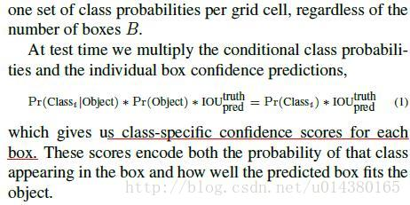
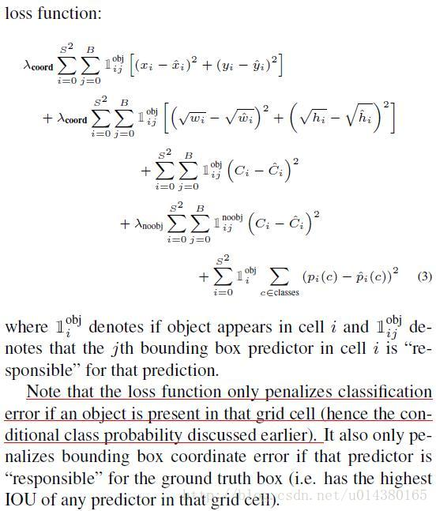
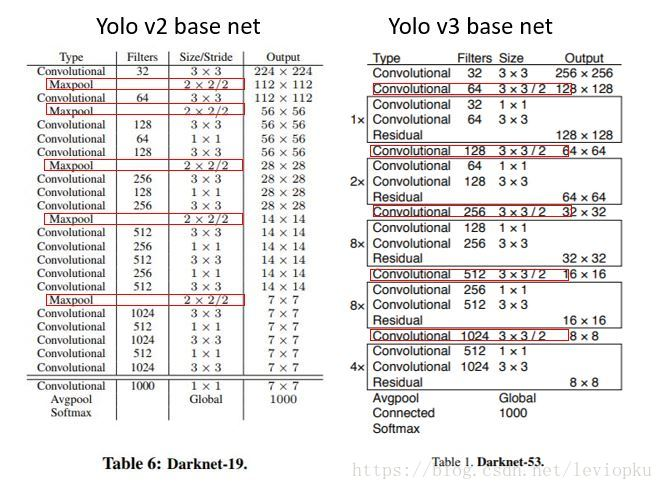

## YOLO 1

### 算法内容

作者在YOLO算法中把物体检测（object detection）问题处理成回归问题，用一个卷积神经网络结构就可以从输入图像直接预测bounding box和类别概率。

YOLO算法的优点：

1. YOLO的速度非常快。在Titan X GPU上的速度是45 fps（frames per second），加速版的YOLO差不多是150fps。
2. YOLO是基于图像的全局信息进行预测的。这一点和基于sliding window以及region proposal等检测算法不一样。与Fast R-CNN相比，YOLO在误检测（将背景检测为物体）方面的错误率能降低一半多。
3. YOLO可以学到物体的generalizable representations。可以理解为泛化能力强。
4. 准确率高.

结构上主要的特点就是 unified detection，不再是原来许多步骤组成的物体检测，这使得模型的运行速度快，可以直接学习图像的全局信息，且可以end-to-end训练。

### 算法细节

算法首先把输入图像划分成S*S的格子，然后对每个格子都预测B个bounding boxes，每个bounding box都包含5个预测值：x,y,w,h和confidence。

x,y就是bounding box的中心坐标，与grid cell对齐（即相对于当前grid cell的偏移值），使得范围变成0到1；w和h进行归一化（分别除以图像的w和h，这样最后的w和h就在0到1范围）

另外每个格子都预测C个假定类别的概率。在本文中作者取S=7，B=2，C=20（因为PASCAL VOC有20个类别），所以最后有7*7*30个tensor。如Fig2，比较好理解。

这里confidence的计算公式如下：

每个bounding box都对应一个confidence score，如果grid cell里面没有object，confidence就是0，如果有，则confidence score等于预测的box和ground truth的IOU值，见上面公式。

所以如何判断一个grid cell中是否包含object呢？答案是：如果一个object的ground truth的中心点坐标在一个grid cell中，那么这个grid cell就是包含这个object，也就是说这个object的预测就由该grid cell负责。

每个grid cell都预测C个类别概率，表示一个grid cell在包含object的条件下属于某个类别的概率，如下图：

下面截图连接上面。注意grid cell和bounding box的区别，类别概率是针对grid cell的。

这个乘法具体是怎么做的呢？请看下图：每个bounding box的confidence和每个类别的score相乘，得到每个bounding box属于哪一类的confidence score。

即得到每个bounding box属于哪一类的confidence score。也就是说最后会得到20*（7*7*2）=20*98的score矩阵，括号里面是bounding box的数量，20代表类别。接下来的操作都是20个类别轮流进行：在某个类别中（即矩阵的某一行），将得分少于阈值（0.2）的设置为0，然后再按得分从高到低排序。

最后再用NMS算法去掉重复率较大的bounding box（NMS:针对某一类别，选择得分最大的bounding box，然后计算它和其它bounding box的IOU值，如果IOU大于0.5，说明重复率较大，该得分设为0，如果不大于0.5，则不改；这样一轮后，再选择剩下的score里面最大的那个bounding box，然后计算该bounding box和其它bounding box的IOU，重复以上过程直到最后）。

最后每个bounding box的20个score取最大的score，如果这个score大于0，那么这个bounding box就是这个socre对应的类别（矩阵的行），如果小于0，说明这个bounding box里面没有物体，跳过即可。

### 两个小细节

1. 作者先在ImageNet数据集上预训练网络，而且网络只采用fig3的前面20个卷积层，输入是224*224大小的图像。然后在检测的时候再加上随机初始化的4个卷积层和2个全连接层，同时输入改为更高分辨率的448*448。
2. Relu层改为pRelu，即当x<0时，激活值是0.1*x，而不是传统的0。

### 损失函数

损失函数方面，作者采用sum-squared error的方式把localization error（bounding box的坐标误差）和classificaton error整合在一起。

但是如果二者的权值一致，容易导致模型不稳定，训练发散。因为很多grid cell是不包含物体的，这样的话很多grid cell的confidence score为0。

所以采用设置不同权重方式来解决，一方面提高localization error的权重，另一方面降低没有object的box的confidence loss权值，loss权重分别是5和0.5。而对于包含object的box的confidence loss权值还是原来的1

这里详细讲一下loss function。在loss function中，前面两行表示localization error(即坐标误差)，第一行是box中心坐标(x,y)的预测，第二行为宽和高的预测。这里注意用宽和高的开根号代替原来的宽和高，这样做主要是因为相同的宽和高误差对于小的目标精度影响比大的目标要大。举个例子，原来w=10，h=20，预测出来w=8，h=22，跟原来w=3，h=5，预测出来w1，h=7相比，其实前者的误差要比后者小，但是如果不加开根号，那么损失都是一样：4+4=8，但是加上根号后，变成0.15和0.7。

第三、四行表示bounding box的confidence损失，就像前面所说的，分成grid cell包含与不包含object两种情况。这里注意下因为每个grid cell包含两个bounding box，所以只有当ground truth 和该网格中的某个bounding box的IOU值最大的时候，才计算这项。
第五行表示预测类别的误差，注意前面的系数只有在grid cell包含object的时候才为1。

### 所以具体实现的时候是什么样的过程呢？

训练的时候：输入N个图像，每个图像包含M个object，每个object包含4个坐标（x，y，w，h）和1个label。然后通过网络得到7 * 7 * 30大小的三维矩阵。

每个1*30的向量前5个元素表示第一个bounding box的4个坐标和1个confidence，第6到10元素表示第二个bounding box的4个坐标和1个confidence。最后20个表示这个grid cell所属类别。

注意这30个都是预测的结果。然后就可以计算损失函数的第一、二 、五行。至于第二三行，confidence可以根据ground truth和预测的bounding box计算出的IOU和是否有object的0,1值相乘得到。真实的confidence是0或1值，即有object则为1，没有object则为0。 这样就能计算出loss function的值了。

测试的时候：输入一张图像，跑到网络的末端得到7 * 7 * 30的三维矩阵，这里虽然没有计算IOU，但是由训练好的权重已经直接计算出了bounding box的confidence。然后再跟预测的类别概率相乘就得到每个bounding box属于哪一类的概率。

### YOLO算法的缺点：

- 位置精确性差，对于小目标物体以及物体比较密集的也检测不好，比如一群小鸟。
- YOLO虽然可以降低将背景检测为物体的概率，但同时导致召回率较低。
  
### 问题

一个grid cell中是否有object怎么界定？
首先要明白grid cell的含义，以文中7*7为例，这个size其实就是对输入图像（假设是224*224）不断提取特征然后sample得到的（缩小了32倍），然后就是把输入图像划分成7*7个grid cell，这样输入图像中的32个像素点就对应一个grid cell。

回归正题，那么我们有每个object的标注信息，也就是知道每个object的中心点坐标在输入图像的哪个位置，那么不就相当于知道了每个object的中心点坐标属于哪个grid cell了吗，而只要object的中心点坐标落在哪个grid cell中，这个object就由哪个grid cell负责预测，也就是该grid cell包含这个object。另外由于一个grid cell会预测两个bounding box，实际上只有一个bounding box是用来预测属于该grid cell的object的，因为这两个bounding box到底哪个来预测呢？

答案是：和该object的ground truth的IOU值最大的bounding box。

## YOLO 2

### BN（batch normalization）的引入

BN自提出以来已经在多个视觉领域得到了较好的证明。Yolo v2通过在之前Yolo中用到的所有conv层加入bn，整个模型的检测mAP有效提升了近2%。此外BN的引入也让作者放弃了在新的模型中使用之前用于防止模型过拟合的dropout层。

### finetune时高精度分类器的使用

当初Yolo模型在训练时先使用224x224的图片输入来预训练自己的特征提取网络；然后再将输入的图片尺度增大到448x448，进面继续使用检测数据集对其进行finetune。这意味着上述finetune中网络需要重新学习识别大尺度（448）的图片以及学习进行其上的目标检测工作。

在Yolo v2中，在拿到224x224的分类数据集train过的模型后先使用448x448的分类数据集finetune上10个epochs，然后再使用448x448的目标检测数据集进行接下来的目标检测工作的finetune。。

实现表明finetune时高精度分类器的预先finetune操作可带来最终目标检测模型近4%的map提升。

### 使用卷积操作的Anchor boxes

而在Yolo v2中，像Faster-RCNN的RPN网络或者SSD等一样，开始直接使用conv filters来提取生成prior boxes（又叫Anchor boxes）的位置偏移及类别等信息。

与其它网络略不同的是Yolo v2特意选了416x416的image size作为输入，这样经过前端的数个特征提取卷积层与pool层后（stride为32），最终的feature map大小为13x13，恰是个奇数。

这样它就可以有效地预测最中心grid位置的目标（这一trick来自于一个数据集常识即一般我们training用的数据集上，目标往往是在图片的中央区域）。

相对于Yolo v1中直接使用FC来预测目标框的类别与位置，使用卷积生成anchor boxes位置与类别的方法会带来mAP约0.3的下降，但会导致较大的召回率（Recall ratio）提升，约7%。这使得这一模型可进一步改良、提升的空间加大。

### 使用K-means cluster来选取anchor boxes

作者直接在目标检测训练数据集上对所有的目标框进行k-means聚类最终得到了Avg IOU与模型复杂度均不错的anchor boxes组合。如下为所使用的k-means中的距离衡量公式：

d(box; centroid) = 1 − IOU(box; centroid)

如下是它在VOC与COCO数据集上的聚类结果。最终在模型训练时选取了k = 5个anchor box。

### 直接目标框位置检测

Yolo v2同RPN等网络一样使用了卷积来生成anchor boxes的位置信息。但它在使用像Faster-RCNN或SSD中那样来进行位置偏离计算的方法来预测predicted box的位置时发现训练时非常容易出现震荡。如下为RPN网络所用的位置计算公式：

x = (tx ∗ wa) − xa

y = (ty ∗ ha) − ya

为了消除此一问题，作者使用如下公式直接对目标框位置进行预测。其中tx, ty, tw, th, 和to为网络预测得到的值，而cx与cy表示anchor box对图片的相对位置，pw与ph是anchor box的长与宽。

bx = σ(tx) + cx

by = σ(ty) + cy

bw = pwetw

bh = pheth

Pr(object) ∗ IOU(b; object) = σ(to)

σ 表示sigmoid，
下图中可看到更详细的解释。

### 细粒度特征的使用

SSD在目标检测时通过使用多尺度的feature maps特征，最终能够cover尺度广泛的目标，从而获得了较高的检测mAP。

Yolo v2也吸取了此一优点。但它并不像SSD那样分别在不同的feature maps之上对不同尺度大小的anchor box进行预测，而是将拥有较细粒度特征的层变形后（使得与后面粗粒度的特征层有着一样的size，有些类似于用于super resolution的subpixel层；比如若其细粒度特征层为26x26x512，而最后一层粗粒度特征层的size则为13x13，于是这里会将它变形为13x13x1024从而与最后一个特征层有着一样的size，进行能在channel level上进行合并）与后面粗粒度的特征层结合在一起用于后续的anchor box预测。

### 多尺度训练

之前Yolo v1的固定图片输入大小为448x448，而Yolo v2因为Anchor box的引入从而将输入变为了416x416。

进一步为了使得模型能够对各种尺度的图片进行有效检测，作者在训练Yolo v2时不再固定image size，而是每训练10个epochs随机地从一个组合{320; 352; :::; 608}中选取（注意它们都是32的倍数，因为darknet网络的步长为32）一个数作为输入的image size。此种训练方法被证明可有效地使得网络学会去自动识别各种尺度大小的图片。

### Darknet-19

Yolo v2还采用了有着19个Conv 层与5个maxpooling层的darknet-19作为模型的特征提取前端网络。在此网络中引入了BN用于稳定训练，加快收敛，同时防止模型过拟合。

## YOLO 3

### backbone

整个v3结构里面，是没有池化层和全连接层的。前向传播过程中，张量的尺寸变换是通过改变卷积核的步长来实现的，比如stride=(2, 2)，这就等于将图像边长缩小了一半(即面积缩小到原来的1/4)。在yolo_v2中，要经历5次缩小，会将特征图缩小到原输入尺寸的1/25 ，即1/32。

输入为416x416，则输出为13x13(416/32=13)。yolo_v3也和v2一样，backbone都会将输出特征图缩小到输入的1/32。所以，通常都要求输入图片是32的倍数。可以对比v2和v3的backbone看看：（DarkNet-19 与 DarkNet-53）

yolo_v2中对于前向过程中张量尺寸变换，都是通过最大池化来进行，一共有5次。而v3是通过卷积核增大步长来进行，也是5次。(darknet-53最后面有一个全局平均池化，在yolo-v3里面没有这一层，所以张量维度变化只考虑前面那5次)。

这也是416x416输入得到13x13输出的原因。从图2可以看出，darknet-19是不存在残差结构(resblock，从resnet上借鉴过来)的，和VGG是同类型的backbone(属于上一代CNN结构)，而darknet-53是可以和resnet-152正面刚的backbone，看下表：

从上表也可以看出，darknet-19在速度上仍然占据很大的优势。其实在其他细节也可以看出(比如bounding box prior采用k=9)，yolo_v3并没有那么追求速度，而是在保证实时性(fps>36)的基础上追求performance。

还有一个tiny-darknet作为backbone可以替代darknet-53，在官方代码里用一行代码就可以实现切换backbone。搭用tiny-darknet的yolo，也就是tiny-yolo在轻量和高速两个特点上，显然是state of the art级别，tiny-darknet是和squeezeNet正面刚的网络，详情可以看下表：

### Output
#### scales

这个借鉴了FPN(feature pyramid networks)，采用多尺度来对不同size的目标进行检测，越精细的grid cell就可以检测出越精细的物体。
y1,y2和y3的深度都是255，边长的规律是13:26:52
对于COCO类别而言，有80个种类，所以每个box应该对每个种类都输出一个概率。
yolo v3设定的是每个网格单元预测3个box，所以每个box需要有(x, y, w, h, confidence)五个基本参数，然后还要有80个类别的概率。所以3*(5 + 80) = 255。这个255就是这么来的。（还记得yolo v1的输出张量吗？ 7x7x30，只能识别20类物体，而且每个cell只能预测2个box，和v3比起来就像老人机和iphoneX一样）

v3用上采样的方法来实现这种多尺度的feature map，可以结合图1和图2右边来看，图1中concat连接的两个张量是具有一样尺度的(两处拼接分别是26x26尺度拼接和52x52尺度拼接，通过(2, 2)上采样来保证concat拼接的张量尺度相同)。

作者并没有像SSD那样直接采用backbone中间层的处理结果作为feature map的输出，而是和后面网络层的上采样结果进行一个拼接之后的处理结果作为feature map。

### ***

- 第一点， 9个anchor会被三个输出张量平分的。根据大中小三种size各自取自己的anchor。

- 第二点，每个输出y在每个自己的网格都会输出3个预测框，这3个框是9除以3得到的，这是作者设置的，我们可以从输出张量的维度来看，13x13x255。255是怎么来的呢，3*(5+80)。80表示80个种类，5表
示位置信息和置信度，3表示要输出3个prediction。在代码上来看，3*(5+80)中的3是直接由num_anchors//3得到的。

- 第三点，作者使用了logistic回归来对每个anchor包围的内容进行了一个目标性评分(objectness score)。根据目标性评分来选择anchor prior进行predict，而不是所有anchor prior都会有输出。

### some tricks

#### Bounding Box Prediction
bbox预测手段是v3论文中提到的又一个亮点。先回忆一下v2的bbbox预测。

想借鉴faster R-CNN RPN中的anchor机制，但不屑于手动设定anchor prior(模板框)，于是用维度聚类的方法来确定anchor box prior(模板框)，最后发现聚类之后确定的prior在k=5也能够又不错的表现，于是就选用k=5。后来呢，v2又嫌弃anchor机制线性回归的不稳定性(因为回归的offset可以使box偏移到图片的任何地方)，所以v2最后选用了自己的方法：直接预测相对位置。预测出bbbox中心点相对于网格单元左上角的相对坐标。

yolo v2直接predict出tx, ty, tw, th, to,并不像RPN中anchor机制那样去遍历每一个pixel。可以从上面的公式看出，bbox的位置大小和confidence都可以通过tx, ty, tw, th, to计算得来，v2相当直接predict出了b-box的位置大小和confidence。

bbox宽和高的预测是受prior影响的，对于v2而言，bbox prior数为5；对于v3而言，在prior这里的处理有明确解释：选用的bbox priors 的k=9，对于tiny-yolo的话，k=6。priors都是在数据集上聚类得来的，有确定的数值，数值如下：

10,13,  16,30,  33,23,  30,61,  62,45,  59,119,  116,90,  156,198,  373,326

每个anchor prior(名字叫anchor prior，但并不是用anchor机制)就是两个数字组成的，一个代表高度另一个代表宽度。

v3对bbox进行预测的时候，采用了logistic regression。这一波操作sao得就像RPN中的线性回归调整bbox。v3每次对bbox进行predict时，输出和v2一样都是tx, ty, tw, th, to，然后通过公式1计算出绝对的(x, y, w, h, c)。

logistic回归用于对anchor包围的部分进行一个目标性评分(objectness score)，即这块位置是目标的可能性有多大。这一步是在predict之前进行的，可以去掉不必要anchor，可以减少计算量

不同于faster R-CNN的是，yolo_v3只会对1个prior进行操作，也就是那个最佳prior。而logistic回归就是用来从9个anchor priors中找到objectness score(目标存在可能性得分)最高的那一个。logistic回归就是用曲线对prior相对于 objectness score映射关系的线性建模。

参考：
https://blog.csdn.net/u014380165/article/details/72616238

https://www.jianshu.com/p/b02f64e0d44b

https://blog.csdn.net/leviopku/article/details/82660381