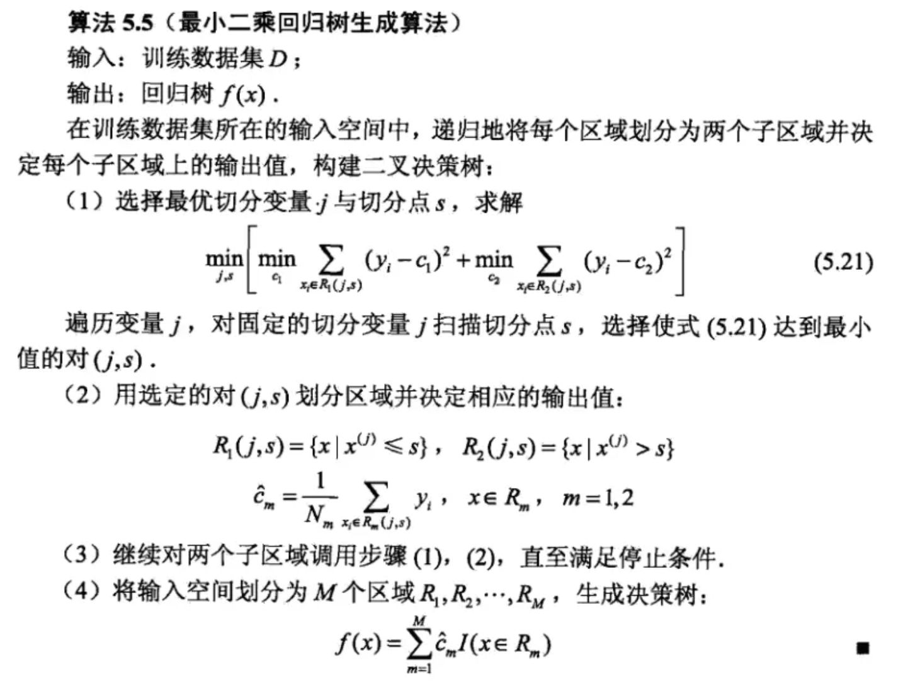
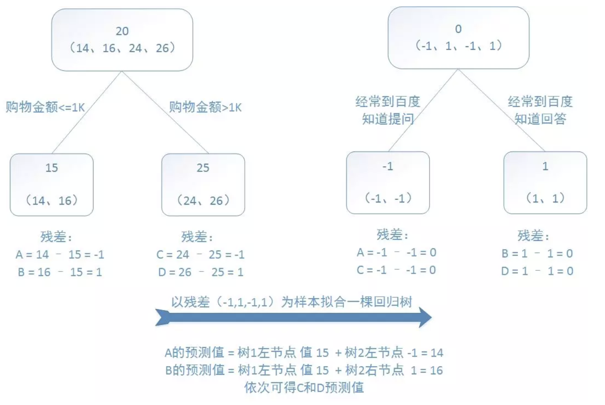
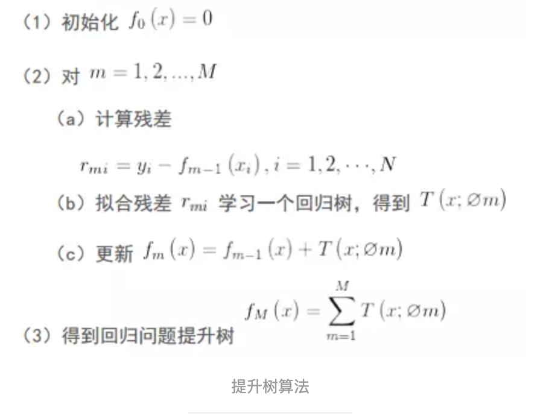
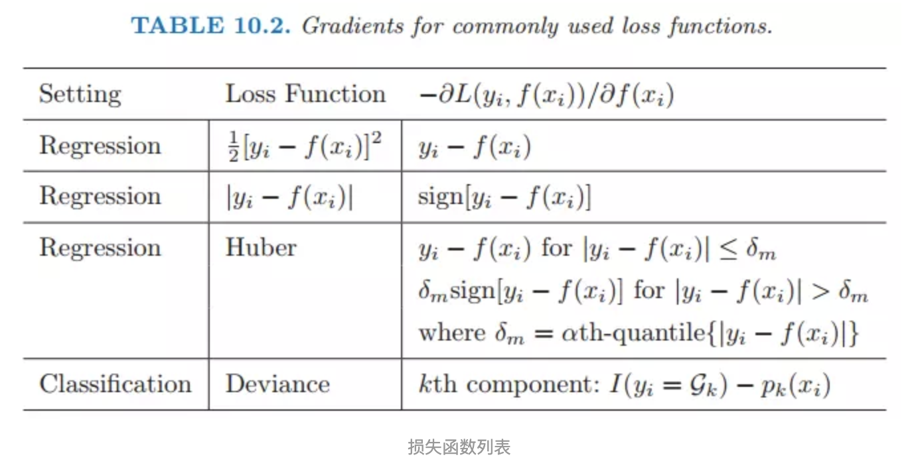
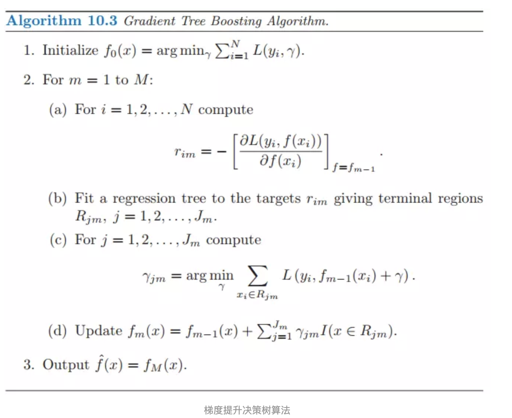
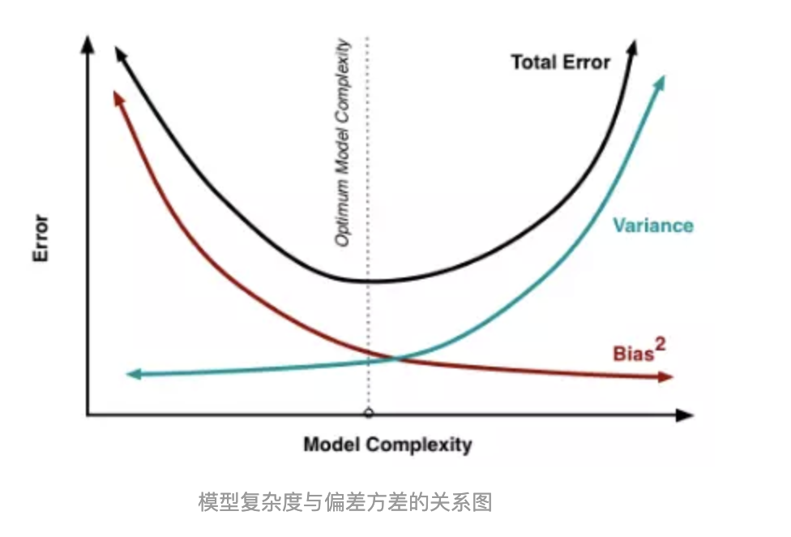

### GBDT-沿着梯度提升的决策树

GBDT有很多简称，有GBT（Gradient Boosting Tree）, GTB（Gradient Tree Boosting ）， GBRT（Gradient Boosting Regression Tree）, MART(Multiple Additive Regression Tree)，其实都是指的同一种算法，本文统一简称GBDT。GBDT在BAT大厂中也有广泛的应用，假如要选择3个最重要的机器学习算法的话，个人认为GBDT应该占一席之地。

GBDT(Gradient Boosting Decision Tree) 又叫 MART（Multiple Additive Regression Tree)，是一种迭代的决策树算法，该算法由多棵决策树组成，所有树的结论累加起来做最终答案。它在被提出之初就和SVM一起被认为是泛化能力较强的算法。

GBDT中的树是回归树（不是分类树），GBDT用来做回归预测，调整后也可以用于分类。
  GBDT的思想使其具有天然优势可以发现多种有区分性的特征以及特征组合。业界中，Facebook使用其来自动发现有效的特征、特征组合，来作为LR模型中的特征，以提高 CTR预估（Click-Through Rate Prediction）的准确性；GBDT在淘宝的搜索及预测业务上也发挥了重要作用。

### GBDT概述

GBDT也是集成学习Boosting家族的成员，但是却和传统的Adaboost有很大的不同。回顾下Adaboost，我们是利用前一轮迭代弱学习器的误差率来更新训练集的权重，这样一轮轮的迭代下去。GBDT也是迭代，使用了前向分布算法，但是弱学习器限定了只能使用CART回归树模型，同时迭代思路和Adaboost也有所不同。

### Regression Decision Tree：回归树

回归树总体流程类似于分类树，区别在于，回归树的每一个节点都会得一个预测值，以年龄为例，该预测值等于属于这个节点的所有人年龄的平均值。分枝时穷举每一个feature的每个阈值找最好的分割点，但衡量最好的标准不再是最大熵，而是最小化平方误差。也就是被预测出错的人数越多，错的越离谱，平方误差就越大，通过最小化平方误差能够找到最可靠的分枝依据。分枝直到每个叶子节点上人的年龄都唯一或者达到预设的终止条件(如叶子个数上限)，若最终叶子节点上人的年龄不唯一，则以该节点上所有人的平均年龄做为该叶子节点的预测年龄。

回归树算法如下图：

### Boosting Decision Tree：提升树算法

提升树是迭代多棵回归树来共同决策。当采用平方误差损失函数时，每一棵回归树学习的是之前所有树的结论和残差，拟合得到一个当前的残差回归树，残差的意义如公式：残差 = 真实值 - 预测值 。提升树即是整个迭代过程生成的回归树的累加。

训练一个提升树模型来预测年龄：
  训练集是4个人，A，B，C，D年龄分别是14，16，24，26。样本中有购物金额、上网时长、经常到百度知道提问等特征。提升树的过程如下：

该例子很直观的能看到，预测值等于所有树值得累加，如A的预测值 = 树1左节点 值 15 + 树2左节点 -1 = 14。

因此，给定当前模型 fm-1(x)，只需要简单的拟合当前模型的残差。现将回归问题的提升树算法叙述如下：

### Gradient Boosting Decision Tree：梯度提升决策树

提升树利用加法模型和前向分步算法实现学习的优化过程。当损失函数是平方损失和指数损失函数时，每一步的优化很简单，如平方损失函数学习残差回归树。

但对于一般的损失函数，往往每一步优化没那么容易，如上图中的绝对值损失函数和Huber损失函数。针对这一问题，Freidman提出了梯度提升算法：利用最速下降的近似方法，即利用损失函数的负梯度在当前模型的值，作为回归问题中提升树算法的残差的近似值，拟合一个回归树。

#### 算法步骤解释：

1. 初始化，估计使损失函数极小化的常数值，它是只有一个根节点的树，即ganma是一个常数值。
2. 逐个样本计算
   1. 计算损失函数的负梯度在当前模型的值，将它作为残差的估计
   2. 估计回归树叶节点区域，以拟合残差的近似值
   3. 利用线性搜索估计叶节点区域的值，使损失函数极小化
   4. 更新回归树
3. 得到输出的最终模型 f(x)

### 重要参数的意义及设置

- 推荐GBDT树的深度：6；（横向比较：DecisionTree/RandomForest需要把树的深度调到15或更高）

#### xgboost/gbdt在调参时为什么树的深度很少就能达到很高的精度？

Boosting主要关注降低偏差，因此Boosting能基于泛化性能相当弱的学习器构建出很强的集成；

Bagging主要关注降低方差，因此它在不剪枝的决策树、神经网络等学习器上效用更为明显。

随机森林(random forest)和GBDT都是属于集成学习（ensemble learning)的范畴。集成学习下有两个重要的策略Bagging和Boosting。

Bagging算法是这样做的：每个分类器都随机从原样本中做有放回的采样，然后分别在这些采样后的样本上训练分类器，然后再把这些分类器组合起来。简单的多数投票一般就可以。其代表算法是随机森林。

Boosting的意思是这样，他通过迭代地训练一系列的分类器，每个分类器采用的样本分布都和上一轮的学习结果有关。其代表算法是AdaBoost,GBDT。

其实就机器学习算法来说，其泛化误差可以分解为两部分，偏差（bias)和方差(variance)。这个可由下图的式子导出（这里用到了概率论公式D(X)=E(X2)-[E(X)]2）。偏差指的是算法的期望预测与真实预测之间的偏差程度，反应了模型本身的拟合能力；方差度量了同等大小的训练集的变动导致学习性能的变化，刻画了数据扰动所导致的影响。这个有点儿绕，不过你一定知道过拟合。

如下图所示，当模型越复杂时，拟合的程度就越高，模型的训练偏差就越小。但此时如果换一组数据可能模型的变化就会很大，即模型的方差很大。所以模型过于复杂的时候会导致过拟合。

当模型越简单时，即使我们再换一组数据，最后得出的学习器和之前的学习器的差别就不那么大，模型的方差很小。还是因为模型简单，所以偏差会很大。

也就是说，当我们训练一个模型时，偏差和方差都得照顾到，漏掉一个都不行。

对于Bagging算法来说，由于我们会并行地训练很多不同的分类器的目的就是降低这个方差(variance) ,因为采用了相互独立的基分类器多了以后，h的值自然就会靠近.所以对于每个基分类器来说，目标就是如何降低这个偏差（bias),所以我们会采用深度很深甚至不剪枝的决策树。

对于Boosting来说，每一步我们都会在上一轮的基础上更加拟合原数据，所以可以保证偏差（bias）,所以对于每个基分类器来说，问题就在于如何选择variance更小的分类器，即更简单的分类器，所以我们选择了深度很浅的决策树。

参考：  
https://www.jianshu.com/p/005a4e6ac775